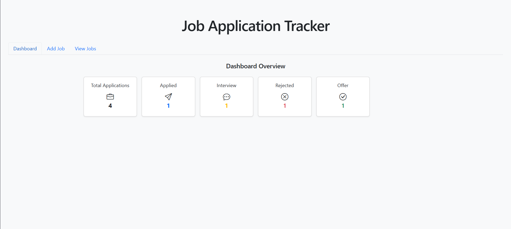
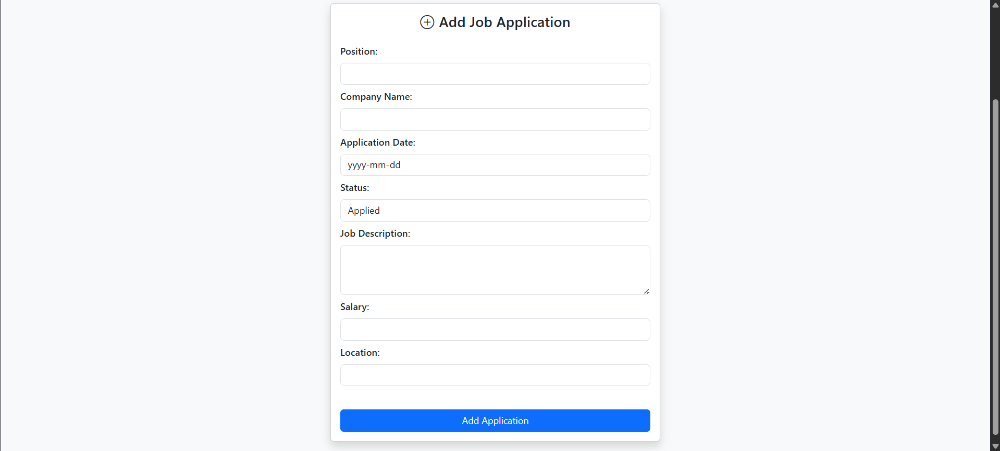
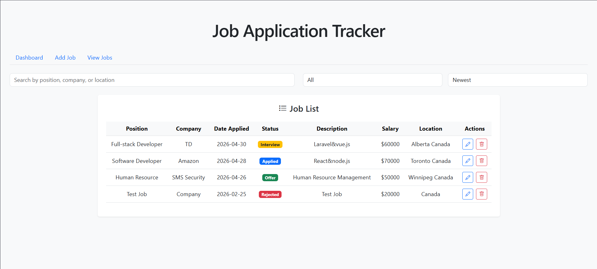
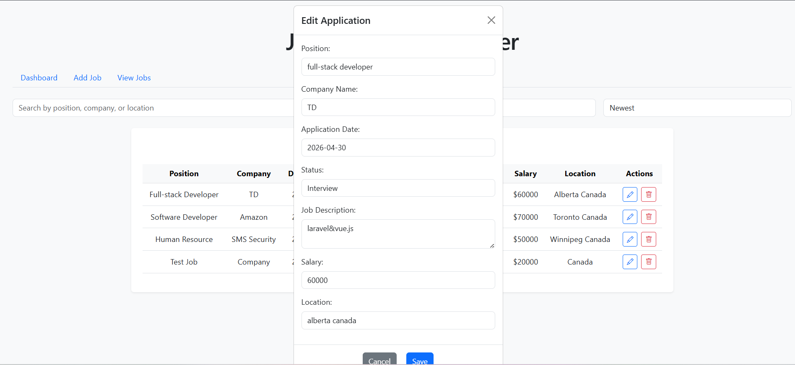

# Job Application Tracker

A React-based job application tracking application that helps users manage, organize, and monitor their job applications efficiently.

---

## 🚀 Features

- Add, edit, and delete job applications
- Edit applications using a modal popup
- Search by position, company, or location
- Filter applications by status
- Sort jobs by application date
- Dashboard with real-time statistics
- Status-based color badges
- Persistent data using localStorage

---

## 🛠️ Tech Stack

- React
- React Router
- Bootstrap
- Bootstrap Icons
- JavaScript (ES6)
- localStorage

---

## 📄 Pages

- **Dashboard** → Overview of job statistics  
- **Add Job** → Add new job applications  
- **View Jobs** → Manage, search, filter, and edit jobs  

---

## 📸 Screenshots

### Dashboard


---

### Add Job


---

### Job List


---

### Edit Modal


---

## ▶️ How to Run Locally

```bash
npm install
npm run dev